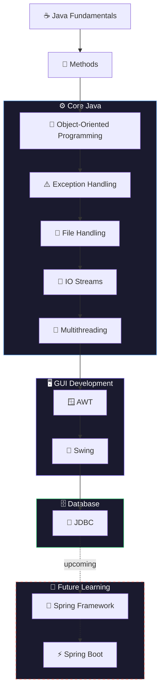

<div align="center">


<br /><br />

# ☕ Java Learning Journey

### A comprehensive, structured repository documenting my progression through **Core Java** —  
from fundamental programming concepts to **OOP, Exception Handling, File Handling, Multithreading, GUI Development, and JDBC**.

<br />

</div>

---

## 📌 Overview

This repository serves as a personal knowledge base and reference guide built while learning Core Java from the ground up. Each module contains practical examples, programs, and mini-applications that solidify theoretical concepts through hands-on implementation.

> **Goal:** Build a strong, production-aware Java foundation before advancing to the Spring ecosystem and full-stack development.

---

## 🏛️ Learning Architecture



---

## 📂 Repository Structure

```
java-learning-journey/
│
├── 01_Basics/                  # Variables, data types, loops, arrays, strings
├── 02_Methods/                 # Method declarations, overloading, return types
├── 03_Classes/                 # OOP — classes, objects, constructors, inheritance
├── 04_Exceptions/              # Try-catch, finally, throw/throws, custom exceptions
├── 05_File_Handling/           # Reading, writing, and file operations
├── 06_IO_Streams/              # Byte streams, character streams, buffered I/O
├── 07_Multithreading/          # Thread class, Runnable, synchronization
├── 08_AWT/                     # GUI basics, event handling, calculator app
├── 09_Swing/                   # Advanced GUI, menus, dialogs, forms
└── 10_JDBC/                    # MySQL connectivity, CRUD, prepared statements
```

---

## 🧠 Topics Covered

<details>
<summary><b>🔹 Java Fundamentals</b></summary>

| Topic | Description |
|---|---|
| Variables & Data Types | Primitive and reference types |
| Operators | Arithmetic, logical, bitwise, ternary |
| User Input | `Scanner` class and console input |
| Conditional Statements | `if-else`, `switch-case` |
| Loops | `for`, `while`, `do-while`, enhanced `for` |
| Arrays | 1D, 2D arrays, array manipulation |
| Strings | String methods, `StringBuilder`, immutability |

</details>

<details>
<summary><b>🔹 Methods</b></summary>

| Topic | Description |
|---|---|
| Method Declaration | Syntax, access modifiers, naming conventions |
| Overloading | Multiple methods with the same name |
| Parameters & Arguments | Pass by value, varargs |
| Return Types | `void`, primitive, and object returns |

</details>

<details>
<summary><b>🔹 Object-Oriented Programming</b></summary>

| Pillar | Key Concepts |
|---|---|
| Classes & Objects | Blueprints, instantiation, `this` keyword |
| Constructors | Default, parameterized, constructor chaining |
| Inheritance | `extends`, method overriding, `super` |
| Polymorphism | Compile-time & runtime polymorphism |
| Abstraction | Abstract classes & interfaces |
| Encapsulation | Access modifiers, getters/setters |

</details>

<details>
<summary><b>🔹 Exception Handling</b></summary>

- `try-catch` and multiple catch blocks
- `finally` block and resource cleanup
- `throw` vs `throws`
- Custom exception classes
- Checked vs unchecked exceptions

</details>

<details>
<summary><b>🔹 File Handling & IO Streams</b></summary>

- Reading and writing files with `FileReader` / `FileWriter`
- `FileInputStream` / `FileOutputStream`
- `BufferedReader` / `BufferedWriter` for performance
- Character vs byte streams

</details>

<details>
<summary><b>🔹 Multithreading</b></summary>

- Extending `Thread` class and implementing `Runnable`
- Thread lifecycle: New → Runnable → Running → Blocked → Dead
- `synchronized` keyword and thread safety
- `wait()`, `notify()`, `notifyAll()`

</details>

<details>
<summary><b>🔹 GUI — AWT</b></summary>

- Core components: `Button`, `Label`, `TextField`, `Checkbox`
- `ActionListener`, `MouseListener`, and event handling
- Layout managers: `FlowLayout`, `BorderLayout`, `GridLayout`
- **Mini Project:** Calculator Application

</details>

<details>
<summary><b>🔹 GUI — Swing</b></summary>

- `JRadioButton`, `JComboBox`, `JMenuBar`, `JTabbedPane`
- `JDialog`, `JOptionPane` for dialog boxes
- Mouse events and advanced event handling
- **Mini Project:** Form Application

</details>

<details>
<summary><b>🔹 JDBC — Database Connectivity</b></summary>

| Operation | Description |
|---|---|
| Connection | `DriverManager`, connection strings |
| DDL | Creating and dropping tables |
| DML | `INSERT`, `UPDATE`, `DELETE` records |
| DQL | `SELECT` with filters and ordering |
| Prepared Statements | Parameterized queries |
| SQL Injection Prevention | Safe input handling |

</details>

---

## 🛠️ Tech Stack

| Category | Technology |
|---|---|
| Language | Java (JDK 21) |
| Database | MySQL 8.0 |
| DB Client | MySQL Workbench |
| GUI Frameworks | AWT, Swing |
| DB Connectivity | JDBC |
| IDE | Visual Studio Code |
| Version Control | Git & GitHub |

---

## 📈 Progress Tracker

| Module | Status |
|---|---|
| Java Fundamentals | ✅ Complete |
| Methods | ✅ Complete |
| Object-Oriented Programming | ✅ Complete |
| Exception Handling | ✅ Complete |
| File Handling | ✅ Complete |
| IO Streams | ✅ Complete |
| Multithreading | ✅ Complete |
| AWT | ✅ Complete |
| Swing | ✅ Complete |
| JDBC | ✅ Complete |
| Spring Framework | 🔜 Upcoming |
| Spring Boot | 🔜 Upcoming |
| REST APIs | 🔜 Upcoming |
| Full-Stack Development | 🔜 Upcoming |

---

## 🎯 Purpose & Goals

This repository was built to:

- ✔️ Develop a solid, well-rounded understanding of Core Java
- ✔️ Practice OOP design principles through real code
- ✔️ Learn Java GUI development using AWT and Swing
- ✔️ Integrate Java applications with a relational database via JDBC
- ✔️ Establish a strong foundation before advancing to the Spring ecosystem

---

## 🚀 Getting Started

```bash
# Clone the repository
git clone https://github.com/Saiyam-Kumar/java-learning-journey.git

# Navigate into the project
cd java-learning-journey

# Open in VS Code
code .
```

> **Prerequisites:** Java JDK 21+, MySQL 8.0+, VS Code or any Java IDE

---

## 👨‍💻 Author

<div align="center">

**Saiyam Kumar**  
*Passionate about Java Development, Problem Solving, and Software Engineering*

[](https://github.com/Saiyam-Kumar)

</div>

---

<div align="center">

*If this repository helped you in any way, consider giving it a* ⭐ — *it means a lot!*

</div>
