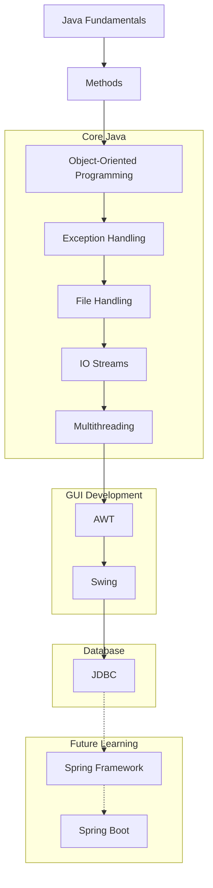

# ☕ Java Learning Journey

A structured repository documenting my journey of learning **Core Java**, starting from fundamental programming concepts and progressing through **Object-Oriented Programming, Exception Handling, File Handling, Multithreading, GUI Development (AWT & Swing), and JDBC**.

This repository contains practical examples, programs, and mini applications that helped me build a strong foundation in Java development.

---

## 🏛 Learning Architecture



---

## 📚 Repository Structure

```text
01) Basics
02) Methods
03) Classes
04) Exceptions
05) File Handling
06) IO Streams
07) Multithreading
08) AWT
09) Swing
10) JDBC
```

---

## 🚀 Topics Covered

### 🔹 Java Fundamentals

* Variables & Data Types
* Operators
* User Input
* Conditional Statements
* Loops
* Arrays
* Strings

### 🔹 Methods

* Method Declaration
* Method Overloading
* Parameters & Arguments
* Return Types

### 🔹 Object-Oriented Programming

* Classes & Objects
* Constructors
* Inheritance
* Polymorphism
* Abstraction
* Encapsulation

### 🔹 Exception Handling

* Try-Catch Blocks
* Multiple Catch Blocks
* Finally Block
* Throw & Throws
* Custom Exceptions

### 🔹 File Handling

* Reading Files
* Writing Files
* File Operations

### 🔹 IO Streams

* FileInputStream
* FileOutputStream
* Buffered Streams
* Character Streams

### 🔹 Multithreading

* Thread Class
* Runnable Interface
* Thread Lifecycle
* Synchronization

### 🔹 AWT

* Buttons
* Labels
* Text Fields
* Checkboxes
* Event Handling
* Calculator Application

### 🔹 Swing

* Radio Buttons
* Combo Boxes
* Menus
* Mouse Events
* Dialog Boxes
* Tabbed Panes
* Form Applications

### 🔹 JDBC

* Database Connectivity
* Creating Tables
* Inserting Records
* Reading Records
* Updating Records
* Deleting Records
* Prepared Statements
* SQL Injection Prevention

---

## 🛠 Technologies Used

* Java (JDK 21)
* MySQL
* MySQL Workbench
* JDBC
* AWT
* Swing
* Git
* GitHub
* VS Code

---

## 🎯 Purpose

This repository was created to:

* Strengthen Core Java concepts
* Understand Object-Oriented Programming
* Learn Java GUI Development
* Work with Databases using JDBC
* Build a strong foundation before moving to advanced Java technologies

---

## 📈 Current Progress

✅ Java Fundamentals

✅ Methods

✅ Object-Oriented Programming

✅ Exception Handling

✅ File Handling

✅ IO Streams

✅ Multithreading

✅ AWT

✅ Swing

✅ JDBC

---

## 🎯 Next Learning Goals

🔜 Spring Framework

🔜 Spring Boot

🔜 REST APIs

🔜 Backend Development

🔜 Full-Stack Java Applications

---

## 👨‍💻 Author

**Saiyam Kumar**

Passionate about Java Development, Problem Solving, and Software Engineering.

GitHub: https://github.com/Saiyam-Kumar

---

⭐ If you found this repository useful, consider giving it a star.

